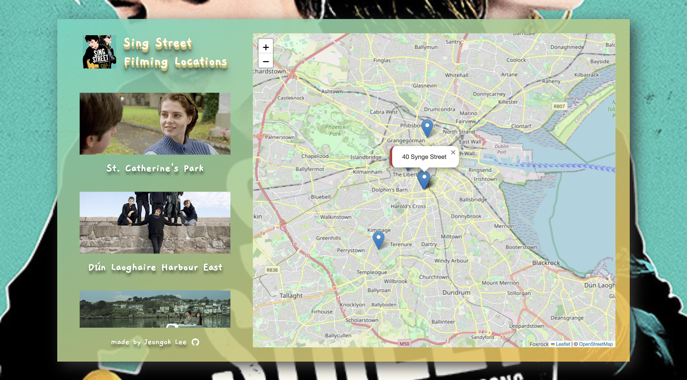
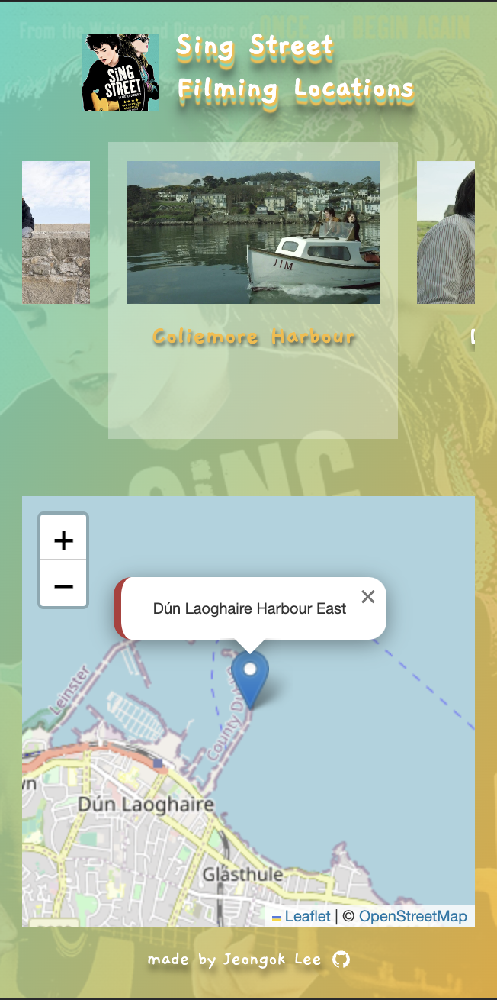

# Welcome to My Movie Locations Project!

<p align='center'>

</p>

<div align="center">


</div>

## https://singstreet-filming-locations.netlify.app

Do you love movies? How about Irish films? I'm a big fan of John Carney's movie, "Sing Street." Little did I know, the fish and chips shop just outside my house in Dublin was actually a filming location for the movie! When I left for Korea, I couldn't help but wish I could turn back time and explore the places where the movie was shot.

So, I decided that if the opportunity ever came, I wouldn't forget to visit all those filming locations. I've started this project, and for now, I'm focusing on just this one movie. But stay tuned! More of my favorite films will be added gradually. 😉

Feel free to explore the locations and share your thoughts. Thanks for checking out my project!

## Key Features

- Movie Filming Location Information Guide
- Locations visited can be marked separately
- Visited places are stored in localStorage
- Styling with SCSS and responsive design for different devices supported

<p align='center' width='100%'>



</p>

영화 좋아하세요? 혹시 아일랜드 영화는 어떠신가요? 저는 John Carney 감독의 영화 Sing Street를 정말 좋아하는데요. 더블린에서의 8개월간 집 앞에 있는 피시앤칩스 식당이 영화 촬영지인 줄도 모르고 한국에 왔을 때 시간을 되돌리고만 싶었죠. 그리고 언젠가 기회가 온다면 잊지 않고 모든 촬영지를 방문해보고자 이 프로젝트를 시작했습니다. 현재는 이 영화 한 편만을 다루고 있으나 추후 제가 좋아하는 영화를 우선으로 차츰 추가될 예정입니다. 😉

## 주요 기능

- 영화 촬영지 위치 정보 안내
- 방문한 장소는 별도 표시 가능
- localStorage에 저장하여 유지되는 방문 장소
- SCSS를 사용한 스타일링과 디바이스에 따른 반응형 디자인 지원

## How To Use

To clone and run this application, you'll need [Git](https://git-scm.com) and [Node.js](https://nodejs.org/en/download/) (which comes with [npm](http://npmjs.com)) installed on your computer. From your command line:

```bash
# Clone this repository
$ git clone https://github.com/ok-olly/sing-street.git

# Go into the repository
$ cd sing-street

# Install dependencies
$ npm install

# Run the app
$ npm start
```

> olivia.jeongok.lee@gmail.com &nbsp;&middot;&nbsp;
> GitHub [@ok-olly](https://github.com/ok-olly)
